# **KS0540 KS0541 Keyestudio BASIC Starter Learning Kit**


# **1. Introduction**

Do you want to learn about programming?

As long as you are passionate about science and dare to explore new things, this kit is surely the best choice for you.

The kit is a learning kit for two programming methods, including Scratch graphical programming and C language programming based on Arduino.  you can create numerous fascinating experiments with the PLUS mainboard, sensors, modules and electronic components. 

As many as 20 project tutorials are provided, which contain detailed wiring diagrams, component knowledge, test code, and so on. 

In addition, you can master the use of electronics, physics, science and programming by building up experiment with this kit.

# **2. Kit List**

**(KS0540 includes Plus mainboard, yet KS0541 does not include Plus board.)**

|          NAME          |                             PIC                              | QTY  |
| :--------------------: | :----------------------------------------------------------: | :--: |
|     Plus Mainboard     |  |  1   |
|        Blue LED        |  |  10  |
|        Red LED         |  |  10  |
|       Yellow LED       |  |  10  |
|       Green LED        |  |  10  |
|          RGB           |  |  1   |
|     220Ω Resistor      |  |  10  |
|     10KΩ Resistor      | 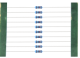 |  10  |
|      1KΩ Resistor      |  |  10  |
|     4.7KΩ Resistor     |  |  10  |
|   10KΩ Potentiometer   | 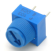 |  1   |
|     Active Buzzer      |  |  1   |
|     Passive Buzzer     |  |  1   |
|         Button         |  |  4   |
|      Tilt Switch       |  |  1   |
|     Photoresistor      |  |  3   |
|      Flame Sensor      |  |  1   |
|       Yellow Cap       |  |  2   |
|        Blue Cap        |  |  2   |
|      IC 74HC595N       |  |  1   |
|  4-Digit Tube Display  |  |  1   |
|  1-Digit Tube Display  |  |  1   |
| 8*8 Dot Matrix Display | 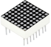 |  1   |
|       White LED        |  |  10  |
|     LCD_128X32_DOT     |  |  1   |
|      S8050 Triode      |  |  2   |
|      S8550 Triode      |  |  2   |
|          Fan           |  |  1   |
|        DC Motor        |  |  1   |
|       Thermistor       |  |  1   |
|    Resistance Card     |  |  1   |
|      Jumper Wire       |  |  30  |
|    F-F Dupont Wire     |  |  10  |
|       Breadboard       |  |  1   |
|       USB Cable        |  |  1   |


# **3. Keyestudio PLUS Mainboard**

The Keyestudio PLUS motherboard, fully compatible with the Arduino IDE control board, is the core of this kit.

It incorporates all functions of Arduino UNO R3. Additionally, multiple improvements on the PLUS board make it more powerful.

Thus, it must be your best choice for building circuits and programs.


**Specifications:**

-   Microcontroller: ATMEGA328P-AU

-   USB to serial chip: CP2102

-   Working voltage: DC 5V or 3.3V (DIP switch control)

-   External power supply: DC 6V to 15V (9V is recommended.)

-   Digital I/O pins: 14 (D0 to D13)

-   PWM channel: 6 (D3 D5 D6 D9 D10 D11)

-   Analog input channel (ADC): 8 (A0 to A7)

-   DC output capacity of each I/O port: 20mA

-   Output capacity of 3.3V port: 50mA

-   Flash Memory: 32KB(of which the bootloader uses 0.5KB)

-   SRAM: 2 KB (ATMEGA328P-AU)

-   EEPROM: 1 KB (ATMEGA328P-AU)

-   Clock speed: 16MHz

-   On-board LED pin: D13

**Pinout**

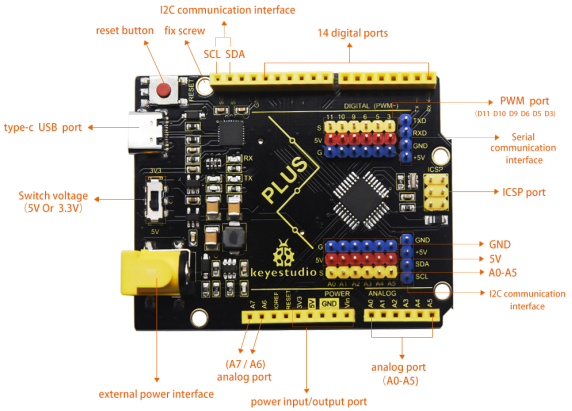

**Specialized Functions of Pins:**

-   Serial communication interface: D0 is RX, D1 is TX

-   PWM interface (pulse width modulation): D3 D5 D6 D9 D10 D11

-   External interrupt interface: D2(interrupts 0) and D3 (interrupts 1)

-   SPI communication interface: D10 is SS, D11 is MOSI, D12 is MISO, D13 is SCK
    
-   IIC communication port: A4 is SDA, A5 is SCL

**Note: The all experiments of this learning kit, the DIP switch on the Keyestudio PLUS mainboard is turned to the 5V terminal by default.**

# **4.How to Download Arduino,Drivers and Library Files**


**Click the link to start learning how to download software, install drivers, upload code, and install library files.**

**[https://getting-started-with-arduino.readthedocs.io](https://getting-started-with-arduino.readthedocs.io/en/latest/Arduino%20IDE%20Tutorial.html)**

# **5.Project**

## **Project 1: Hello World**

 **Introduction**

For Arduino beginners, we will start with some simple things. In this project, you only need a PLUS mainboard and a USB cable to complete the "Hello World!" project.

 **Components Required**

| 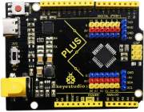 |  |
| :----------------------------------------------------------: | :----------------------------------------------------------: |
|                 Keyestudio PLUS Mainboard\*1                 |                         USB Cable\*1                         |

 **Connection**

****

 **Code**

Arduino uses a serial monitor to display information such as print statements and sensor data. This is a very powerful tool for debugging long code. Let's first learn the“if”statement, which is a control structure in Arduino programming.

```c
/*
Keyestudio 2021 Starter Kit
Project 1
Hello World
http//www.keyestudio.com
*/
char val;//defines variable "val"
void setup()
{
Serial.begin(9600);// sets baud rate to 9600
}
void loop()
{
  if (Serial.available() > 0) {
    val=Serial.read();// reads symbols assigns to "val"
    if(val=='R')// checks input for the letter "R".
    {  // if it’s “R”,    
     Serial.println("Hello World!");// shows“Hello World !”.
    }
  }
}
```

 **Result**

Select the correct Arduino IDE mainboard type and COM port, and click  on the Arduino IDE to upload the code. After successfully uploading, click to enter the serial display.

Whenever you enter an "R" in the text box and click "Send", the serial monitor will display "Hello World!”.


## **Project 2: LED Blinking**

 **Introduction**

In this project, we will show you the LED flashing effect through Arduino's digital pins.

 **Components Required**

|  |  |  |
| :----------------------------------------------------------: | ------------------------------------------------------------ | ------------------------------------------------------------ |
|                 Keyestudio PLUS Mainboard\*1                 | Red LED\*1                                                   | 220Ω Resistor\*1                                             |
| 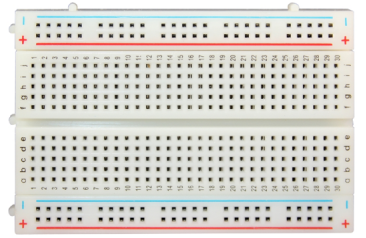 |  |  |
|                        Breadboard\*1                         | Jumper Wire\*2                                               | USB Cable\*1                                                 |

 **Component Knowledge**

**LED:**


It is a kind of semiconductor called "light-emitting diode", which is an electronic device made of semiconductor materials (silicon, selenium, germanium, etc.). It has an anode and a cathode. The short lead (cathode) is grounded. The long lead (anode) is connected to 5V. 


**Resistor**

A resistor is an electronic component in a circuit that restricts or regulates the flow current flow. Its unit is(Ω). 1 mΩ= 1000 kΩ，1kΩ= 1000Ω.


We can use resistors to protect sensitive components, such as LEDs. The strength of the resistance is marked on the body of the resistor with an electronic color code. Each color code represents a number, and you can refer to it in a resistance card.


In this kit, we provide eight 5-band resistors with different resistance values.
Take three 5-band resistors as an example.

220Ω resistor\*10


10KΩ resistor\*10

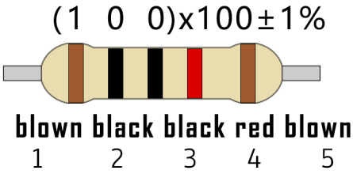

1KΩ resistor\*10


The connection between current, voltage, and resistance can be expressed by the formula: I=U/R. In the figure below, if the voltage is 3V, the current through R1 is: I = U / R = 3 V / 10 KΩ= 0.0003A= 0.3mA.


Do not directly connect resistors with very low resistance to the two poles of the power supply, as this will cause excessive current to damage the electronic components. Resistors do not have positive and negative poles.

**Breadboard**

A breadboard is used to build and test circuits quickly before finalizing any circuit design. The breadboard has many holes into which circuit components like integrated circuits and resistors can be inserted. A typical breadboard is as follows.


The breadboard has strips of metal which run underneath the board and connect the holes on the top of the board. The metal strips are laid out as shown below. Note that the top and bottom rows of holes are connected horizontally while the remaining holes are connected vertically.


The first two rows (top) and the last two rows (bottom) of the breadboard are used for the positive (+) and negative (-) terminals of the power supply, respectively. The conductive layout of the breadboard is shown in the following diagram.


When we connect DIP (Dual In-line Packages) components, such as integrated circuits, microcontrollers, chips and so on, we can see that a groove in the middle isolates the middle part, so the top and bottom of the groove are not connected. DIP components can be connected as shown in the figure below.


 **Circuit Diagram and Wiring Diagram**

As shown in the diagram, we use digital pin 10 and connect one LED to a 220 ohm resistor to avoid high current damage to the LED.


**Circuit Diagram**


**Wiring Diagram**

Note:

How to connect an LED


How to identify the 220Ω five-band resistor


 **Code**

```c
/*
Keyestudio 2021 Starter Kit
Project 2
LED_Blinking 
http//www.keyestudio.com
*/
int ledPin = 10; // defines numeric pin 10.
void setup()
{
pinMode(ledPin, OUTPUT);// defines PIN with connected LED as output
}
void loop()
{
digitalWrite(ledPin, HIGH); // turn on LED
delay(1000); // wait a second.
digitalWrite(ledPin, LOW); // turn off LED
delay(1000); // wait a second
}
```

 **Result**

Upload the project code, wire up components according to the wiring diagram, and power on. The LED will blink.

 **Explanation**

**pinMode(ledPin，OUTPUT)**: Before using the Arduino's pins, you need to tell the control board whether it is INPUT or OUTPUT. We use a built-in function “pinMode()” to do this.

**digitalWrite(ledPin，HIGH)** : When using a pin as an OUTPUT, it can be commanded as HIGH (output 5V) or LOW (output 0V).

## **Project 3: Breathing Led**

 **Introduction**

In this project, we will learn the PWM control of ARDUINO. PWM is Pulse Width Modulation, which is a technique that encodes analog signal levels into digital signal levels. We will use PWM to control the brightness of LED.

**Components Required**

|  |  |  |
| :----------------------------------------------------------: | ------------------------------------------------------------ | ------------------------------------------------------------ |
|                 Keyestudio Plus Mainboard\*1                 | Red LED\*1                                                   | 220Ω Resistor\*1                                             |
|  |  |  |
|                        Breadboard\*1                         | Jumper Wire\*2                                               | USB Cable\*1                                                 |

 **Component Knowledge**


**Working principle** 

It can control the brightness of LED, the speed of DC motors and Servo motors, and outputs square wave signal. If we want to dim the LED, we can change the ON(open) and OFF(close) time of the signal. When we change the time of ON and OFF fast enough, then the brightness of the LED will change. Here are some terms related to PWM as follows.

ON (open)：When the signal is high.

OFF (close)：When the signal is low.

Period: It is the sum of the time of On and Off.

Duty cycle: The percentage of time when the signal is at a high level for a certain period of time. At 50% duty cycle and 1Hz frequency, the LED will be on for half a second and off for the other half of a second.


**Arduino and PWM**

The Arduino IDE has a built-in function “analogWrite()” that can be used to generate PWM signals. Most of the pins generate signals with a frequency of about 490Hz and we can use this function to give values from 0 to 255.

“analogWrite(0)” indicates a signal with 0% duty cycle. “analogWrite(127)” indicates a signal with 50% duty cycle. “analogWrite(255)” indicates a signal with 100% duty cycle. On the Plus control board, the PWM pins are 3, 5, 6, 9, 10, and 11. PWM pins are marked with the “~”symbol. In this project, you will learn how to get the PWM output from the digital pins of the Plus control board and control the brightness of the LED by code.

 **Circuit Diagram and Wiring Diagram**


**Note:**

How to connect the LED


How to identify the 220Ω 5-band resistor


 **Code**

```c
/*
Keyestudio 2021 Starter Kit
Project 3
Breathing_Led
http//www.keyestudio.com
*/
int ledPin = 6;
 void setup() 
{
  pinMode(ledPin,OUTPUT);
}
void loop(){
  for (int value = 0 ; value < 255; value=value+1){
    analogWrite(ledPin, value);
    delay(5);
  }
  for (int value = 255; value >0; value=value-1){
    analogWrite(ledPin, value);
    delay(5);
  } 
}      
```

 **Result**

After burning the project code, connecting the wires according to the wiring diagram, and powering on, the LED lights up gradually, and then gradually darkens.

 **Explanation**

When we need to execute a sentence repeatedly, we can use the “for” statement.

The “for” statement format is as follows:


The loop sequence of“for”statement is as follows:

Round 1: 1 → 2 → 3 → 4

Round 2: 2 → 3 → 4

…

Until 2 does not hold and the “for” statement loop ends.

Knowing this sequence, go back to the code.

```c
for (int value = 0; value < 255; value=value+1){
       }
for (int value = 255; value >0; value=value-1){
       }
```

These two for statements, which realize that the value can continuously increases from 0 to 255, then decreases from 255 to 0. The loop continues indefinitely.

In the “for”statement, involving a new function “analogWrite()”.

 We know that the digital port has only two states, 0 and 1. How to send an analog value to a digital pin? This function will be used. Take a look at the Arduino board and look at the digital pins. You will find that 6 of the pins are marked with "~". These pins are different from other pins in that they can output PWM signals.

The format as follow:

**analogWrite(pin,value)**

The “analogWrite()” function is used to input an analog value from 0 to 255 to the PWM port. Therefore, the value is between 0 and 255. Note that the “analogWrite()” function can only write to the digital pins with PWM function, that is, the 3, 5, 6, 9, 10, and 11 pins.

## **Project 4: Traffic Light**

 **Introduction**

Traffic lights are closely related to people's daily lives. Traffic lights generally show red, yellow, and green. Everyone should obey the traffic rules, which can avoid many traffic accidents. In this project, we will use a PLUS board and some LEDs (red, green and yellow) to simulate the traffic lights.

 **Components Required**

|  |  |  |  |
| ------------------------------------------------------------ | ------------------------------------------------------------ | ------------------------------------------------------------ | ------------------------------------------------------------ |
| Keyestudio Plus Mainboard\*1                                 | Red LED\*1                                                   | Yellow LED\*1                                                | Green LED\*1                                                 |
|  |  |  |  |
| USB Cable\*1                                                 | 220Ω Resistor\*3                                             | Breadboard\*1                                                | Jumper Wires                                                 |

 **Circuit Diagram and Wiring Diagram**


Note:

How to connect an LED


How to identify the 220Ω 5-band resistor


 **Code**

The flashing time of each LED should be the same as the traffic lights. In this program, we use “Arduino delay ()” to control the delay time.

```c
/*
Keyestudio 2021 Starter Kit
Project 4
Traffic_Light
http//www.keyestudio.com
*/
int redled =10; // initializes digital PIN 10
int yellowled =7; // initializes digital PIN 7
int greenled =4; // initializes digital PIN 4
void setup()
{
pinMode(redled, OUTPUT);// sets digital PIN 10 to “output”
pinMode(yellowled, OUTPUT); // sets digital PIN 7 to “output”
pinMode(greenled, OUTPUT); // sets digital PIN 4 to “output”
}
void loop()
{
digitalWrite(greenled, HIGH);// turns on LED
delay(5000);// delays 5 seconds
digitalWrite(greenled, LOW); // turns off LED
for(int i=0;i<3;i++)// flashes 3 times.
{
delay(500);// delays 0.5 second
digitalWrite(yellowled, HIGH);// turns on LED
delay(500);// delays 0.5 second
digitalWrite(yellowled, LOW);// turns off LED
} 
delay(500);// delays 0.5 second
digitalWrite(redled, HIGH);// turns on LED
delay(5000);// delays 5 second
digitalWrite(redled, LOW);// turns off LED
}
```

 **Result**

Upload the code and power on, the green LED will light up for 5s then go off. Next, the yellow one will blink for 3 times and red LED will be on for 5s then go off.

## **Project 5: RGB LED**

 **Introduction**


In this project, we will introduce the RGB LED and show you how to use the Plus control board to control the RGB LED. Even though RGB LED is very basic, it is also a great way to learn the fundamentals of electronics and coding.

 **Components Required**

|  |  |  |
| ------------------------------------------------------------ | ------------------------------------------------------------ | ------------------------------------------------------------ |
| Keyestudio Plus Mainboard\*1                                 | RGB LED\*1                                                   | 220Ω Resistor\*3                                             |
|  |  |  |
| Breadboard\*1                                                | Jumper Wires                                                 | USB  Cable\*1                                                |

 **Component Knowledge**

**RGB LED：**


The monitors mostly adopt the RGB color standard, and all the colors on the computer screen are composed of the three colors of red, green and blue mixed in different proportions.


This RGB LED has pin R, G and B and a common cathode. To change its brightness, we can use the PWM pins which can give different duty cycle signals to the RGB LED to produce different colors.

 **Circuit Diagram and Wiring Diagram**


**Note:**

RGB LED longest pin (common cathode) connected to GND.


How to identify the 220Ω 5-band resistor


 **Code**

```c
/*
Keyestudio 2021 starter learning kit
Project 5
RGB LED
http//www.keyestudio.com
*/
int redpin = 11; // select the pin for the red LED
int bluepin =9; // select the pin for the blue LED
int greenpin =10;// select the pin for the green LED
int val;
void setup() {
  pinMode(redpin, OUTPUT);
  pinMode(bluepin, OUTPUT);
  pinMode(greenpin, OUTPUT);
}
void loop() 
{
for(val=255; val>0; val--)
  {
   analogWrite(11, val);
   analogWrite(10, 255-val);
   analogWrite(9, 128-val);
   delay(1); 
  }
for(val=0; val<255; val++)
  {
   analogWrite(11, val);
   analogWrite(10, 255-val);
   analogWrite(9, 128-val);
   delay(1); 
  }
}
```

 **Result**

Upload the project code, wire up, power up and wait a few seconds, you will see a colorful LED.

## **Project 6: Flowing Light**

 **Introduction**

In our daily life, we can see many billboards made up of different colors of LED. They constantly change the light to attract the attention of customers. In this project, we will use Plus control board with 5 LEDs to achieve the effect of flowing water.

 **Components Required**

|  |  |  |
| ------------------------------------------------------------ | ------------------------------------------------------------ | ------------------------------------------------------------ |
| Keyestudio Plus Mainboard\*1                                 | Red LED\*5                                                   | 220Ω Resistor\*5                                             |
|  |  |  |
| Breadboard \*1                                               | Jumper Wires                                                 | USB Cable\*1                                                 |

 **Circuit Diagram and Wiring Diagram**


**Note:**

How to connect the LED


How to identify the 220Ω 5-band resistor


 **Code**

```c
/*
Keyestudio 2021 Starter Kit 
Project 6
Flowing_Light
http//www.keyestudio.com
*/
int BASE = 2 ;// I/O PIN for the first LED
int NUM = 5; // amount of LEDs
void setup()
{
   for (int i = BASE; i < BASE + NUM; i ++) 
   {
     pinMode(i, OUTPUT);   // sets I/O PIN to "output"
   }
}
void loop()
{
   for (int i = BASE; i < BASE + NUM; i ++) 
   {
     digitalWrite(i, LOW); //sets I/O PIN to "low", turns off LEDs one after the other 
     delay(200); // delay
   }
   for (int i = BASE; i < BASE + NUM; i ++) 
   {
     digitalWrite(i, HIGH);   // sets I/O PIN to "high", turns on LEDs one after the other
     delay(200);  // delay
   }  
}
```

 **Result**

After burning the project code, connecting the wires and powering on, the 5 LEDs connected to the D2 to D6 pins of the development board will gradually light up and then gradually go off, just like a battery charge.

## **Project 7: Active Buzzer**

 **Introduction**

Active buzzer is a sound making element, widely used on computers, printers, alarms, electronic toys, telephones, timers, etc. It has an inner vibration source. In this project, we will use a PLUS control board to control the active buzzer to buzz.

 **Components Required**

|  |  |  |  |  |
| ------------------------------------------------------------ | ------------------------------------------------------------ | ------------------------------------------------------------ | ------------------------------------------------------------ | ------------------------------------------------------------ |
| Keyestudio Plus Mainboard\*1                                 | Active Buzzer\*1                                             | Breadboard \*1                                               | Jumper Wires                                                 | USB Cable\*1                                                 |

 **Component Knowledge**


The active buzzer inside has a simple oscillator circuit which can convert constant direct current into a certain frequency pulse signal. Once active buzzer receives a high level, it will sound. The passive buzzer is an integrated electronic buzzer with no internal vibration source. It must be driven by 2K to 5K square wave instead of a DC signal. The appearance of the two buzzers is very similar, but passive buzzers come with a green circuit board, and active buzzers come with a black tape. Passive buzzers don't have positive pole, but active buzzers have.


 **Circuit Diagram and Wiring Diagram**


Note: The positive terminal ("+"/long pin) of the active buzzer is connected to pin 8, and the negative terminal (short pin) is connected to GND.

 **Code**

```c
/*
Keyestudio 2021 Starter Kit
Project 7
Active_buzzer 
http//www.keyestudio.com
*/
int buzzerPin = 8;
void setup ()
{
  pinMode (buzzerPin, OUTPUT);
}
void loop ()
{
  digitalWrite (buzzerPin, HIGH);
  delay (500);
  digitalWrite (buzzerPin, LOW);
  delay (500);
}
```

 **Result**

Upload the project code, wire up and power up, then the active buzzer buzzes.

## **Project 8: Passive Buzzer**

 **Introduction**

In this project, we will learn the passive buzzer and use the Plus control board to control the passive buzzer to play a song. Unlike an active buzzer, a passive buzzer can emit sounds of different frequencies.

 **Components Required**

|  |  |  |  |  |
| ------------------------------------------------------------ | ------------------------------------------------------------ | ------------------------------------------------------------ | ------------------------------------------------------------ | ------------------------------------------------------------ |
| Keyestudio Plus Mainboard\*1                                 | Passive Buzzer\*1                                            | Breadboard\*1                                                | Jumper Wires                                                 | USB Cable\*1                                                 |

 **Component Knowledge**


A passive buzzer is an integrated electronic buzzer with no internal vibration source. It must be driven by 2K to 5K square wave, not a DC signal. The two buzzers are very similar in appearance, but one buzzer with a green circuit board is a passive buzzer, while the other with black tape is an active buzzer. Passive buzzers cannot distinguish between positive polarity while active buzzers can.

 **Circuit Diagram and Wiring Diagram**

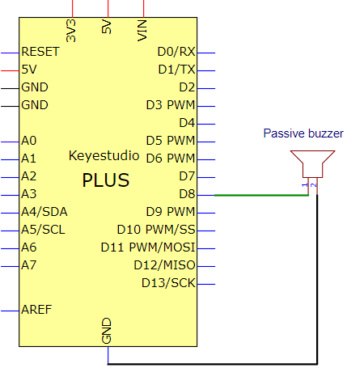


 **Code**

```c
/*
Keyestudio 2021 Starter Kit
Project 8
Passive_buzzer
http//www.keyestudio.com
*/
#define NOTE_B0  31
#define NOTE_C1  33
#define NOTE_CS1 35
#define NOTE_D1  37
#define NOTE_DS1 39
#define NOTE_E1  41
#define NOTE_F1  44
#define NOTE_FS1 46
#define NOTE_G1  49
#define NOTE_GS1 52
#define NOTE_A1  55
#define NOTE_AS1 58
#define NOTE_B1  62
#define NOTE_C2  65
#define NOTE_CS2 69
#define NOTE_D2  73
#define NOTE_DS2 78
#define NOTE_E2  82
#define NOTE_F2  87
#define NOTE_FS2 93
#define NOTE_G2  98
#define NOTE_GS2 104
#define NOTE_A2  110
#define NOTE_AS2 117
#define NOTE_B2  123
#define NOTE_C3  131
#define NOTE_CS3 139
#define NOTE_D3  147
#define NOTE_DS3 156
#define NOTE_E3  165
#define NOTE_F3  175
#define NOTE_FS3 185
#define NOTE_G3  196
#define NOTE_GS3 208
#define NOTE_A3  220
#define NOTE_AS3 233
#define NOTE_B3  247
#define NOTE_C4  262
#define NOTE_CS4 277
#define NOTE_D4  294
#define NOTE_DS4 311
#define NOTE_E4  330
#define NOTE_F4  349
#define NOTE_FS4 370
#define NOTE_G4  392
#define NOTE_GS4 415
#define NOTE_A4  440
#define NOTE_AS4 466
#define NOTE_B4  494
#define NOTE_C5  523
#define NOTE_CS5 554
#define NOTE_D5  587
#define NOTE_DS5 622
#define NOTE_E5  659
#define NOTE_F5  698
#define NOTE_FS5 740
#define NOTE_G5  784
#define NOTE_GS5 831
#define NOTE_A5  880
#define NOTE_AS5 932
#define NOTE_B5  988
#define NOTE_C6  1047
#define NOTE_CS6 1109
#define NOTE_D6  1175
#define NOTE_DS6 1245
#define NOTE_E6  1319
#define NOTE_F6  1397
#define NOTE_FS6 1480
#define NOTE_G6  1568
#define NOTE_GS6 1661
#define NOTE_A6  1760
#define NOTE_AS6 1865
#define NOTE_B6  1976
#define NOTE_C7  2093
#define NOTE_CS7 2217
#define NOTE_D7  2349
#define NOTE_DS7 2489
#define NOTE_E7  2637
#define NOTE_F7  2794
#define NOTE_FS7 2960
#define NOTE_G7  3136
#define NOTE_GS7 3322
#define NOTE_A7  3520
#define NOTE_AS7 3729
#define NOTE_B7  3951
#define NOTE_C8  4186
#define NOTE_CS8 4435
#define NOTE_D8  4699
#define NOTE_DS8 4978
#define REST 0
int tempo=114; // change this to make the song slower or faster
int buzzer = 8;// initializes  digital I/O PIN to control the buzzer
// notes of the moledy followed by the duration. a 4 means a quarter note, 8 an eighteenth , 16 sixteenth, so on. !!negative numbers are used to represent dotted notes so -4 means a dotted quarter note, that is, a quarter plus an eighteenth
int melody[] = {
  NOTE_E4,4,  NOTE_E4,4,  NOTE_F4,4,  NOTE_G4,4,//1
  NOTE_G4,4,  NOTE_F4,4,  NOTE_E4,4,  NOTE_D4,4,
  NOTE_C4,4,  NOTE_C4,4,  NOTE_D4,4,  NOTE_E4,4,
  NOTE_E4,-4, NOTE_D4,8,  NOTE_D4,2,
  NOTE_E4,4,  NOTE_E4,4,  NOTE_F4,4,  NOTE_G4,4,//4
  NOTE_G4,4,  NOTE_F4,4,  NOTE_E4,4,  NOTE_D4,4,
  NOTE_C4,4,  NOTE_C4,4,  NOTE_D4,4,  NOTE_E4,4,
  NOTE_D4,-4,  NOTE_C4,8,  NOTE_C4,2,
  NOTE_D4,4,  NOTE_D4,4,  NOTE_E4,4,  NOTE_C4,4,//8
  NOTE_D4,4,  NOTE_E4,8,  NOTE_F4,8,  NOTE_E4,4, NOTE_C4,4,
  NOTE_D4,4,  NOTE_E4,8,  NOTE_F4,8,  NOTE_E4,4, NOTE_D4,4,
  NOTE_C4,4,  NOTE_D4,4,  NOTE_G3,2,
  NOTE_E4,4,  NOTE_E4,4,  NOTE_F4,4,  NOTE_G4,4,//12
  NOTE_G4,4,  NOTE_F4,4,  NOTE_E4,4,  NOTE_D4,4,
  NOTE_C4,4,  NOTE_C4,4,  NOTE_D4,4,  NOTE_E4,4,
  NOTE_D4,-4,  NOTE_C4,8,  NOTE_C4,2
};
// sizeof gives the number of bytes, each int value is composed of two bytes (16 bits)
// there are two values per note (pitch and duration), so for each note there are four bytes
int notes=sizeof(melody)/sizeof(melody[0])/2; 
// this calculates the duration of a whole note in ms (60s/tempo)*4 beats
int wholenote = (60000 * 4) / tempo;
int divider = 0, noteDuration = 0;
void setup() {
  // iterate over the notes of the melody
  // remember, the array is twice the number of notes (notes + durations)
  for (int thisNote = 0; thisNote < notes * 2; thisNote = thisNote + 2) {
    // calculates the duration of each note
    divider = melody[thisNote + 1];
    if (divider > 0) {
    noteDuration = (wholenote) / divider; // regular note, just proceed
    } else if (divider < 0) {
      // dotted notes are represented with negative durations!!
      noteDuration = (wholenote) / abs(divider);
      noteDuration *= 1.5; // increases the duration in half for dotted notes
    }
    // we only play the note for 90% of the duration, leaving 10% as a pause
    tone(buzzer, melody[thisNote], noteDuration*0.9);
  // Wait for the specief duration before playing the next note
    delay(noteDuration);
    noTone(buzzer);  //  stop the waveform generation before the next note
  }
}
void loop() {
// if you want to repeat the song forever, just paste the setup code here instead.
}
```

 **Result**

 Upload the project code, wire up and power on, then the passive buzzer will play a song.

## **Project 9: 74HC595N Controls 7 LEDs**

 **Introduction**

For a PLUS mainboard, it has only 22 I/O ports, how do we light up a large number of LEDs? In this project, we will use 74HC595N to control 7 LEDs to save port resources.

 **Components Required**

|  |  |  |  |
| ------------------------------------------------------------ | ------------------------------------------------------------ | ------------------------------------------------------------ | ------------------------------------------------------------ |
| Keyestudio Plus Mainboard\*1                                 | Red LED\*7                                                   | 74HC595N Chip\*1                                             | 220Ω Resistor\*7                                             |
|  |  |  |                                                              |
| Breadboard\*1                                                | Jumper Wires                                                 | USB  Cable\*1                                                |                                                              |

 **Component Knowledge**


**74HC595N Chip:** 

To put it simply, 74HC595N chip is a combination of 8-digit shifting register, memorizer and equipped with tri-state output.The shift register and the memorizer are synchronized to different clocks, and the data is input on the rising edge of the shift register clock SCK and goes into the memory register on the rising edge of the memory register clock RCK. If the two clocks are connected together, the shift register is always one pulse earlier than the storage register. The shift register has a serial shift input (SI) and a serial output (SQH) for cascading. The 8-bit shift register can be reset asynchronously (low-level reset), and the storage register has an 8-bit Three-state parallel bus output, when the output enable (OE) is enabled (active low), the storage register is output to the 74HC595N pin (bus).


|             PIN              | FUNCTION                                                     |
| :--------------------------: | ------------------------------------------------------------ |
|           Pin13 OE           | It is an output enable pin to ensure that the data of the latch is input to the Q0 to Q7 pins or not. <br />When it is low, no high level is output. <br />In this experiment, we directly connect to GND and keep the data output low. |
|           Pin14 SI           | This is the pin for 74HC595 to receive data, <br />i.e. serial data input, only one bit can be input at a time, then 8 times in a row, it can form a byte. |
|          Pin10 SCLR          | A pin to initialize the storage register pins. <br />It initializes the internal storage registers at a low level. <br />In this experiment, we connect VCC to maintain a high level. |
|          Pin11 SCK           | The clock pin of the shift register. <br />At the rising edge, the data in the shift register is shifted backward as a whole, <br />and new data input is received. |
|          Pin12 RCK           | The clock input pin of the storage register . <br />At the rising edge, the data is transferred from the shift register to the storage register. <br />At this time, the data is output in parallel from the Q0 to Q7 ports. |
|           Pin9 SQH           | It is a serial output pin dedicated for chip cascading to the SI terminal of the next 74HC595. |
| Q0--Q7<br />(Pin 15, Pin1-7) | Eight-bit parallel output, can directly control the 8 segments of the digital tube. |

VCC and GND are used used for chip power supply, and the operating voltage is 5V.

 **Circuit Diagram and Wiring Diagram**


Note: Pay attention to the direction in which the 74HC595N chip is inserted.


 **Code**

```c
/*
Keyestudio 2021 Starter Kit
Project 9
74HC595N_control_7_LEDS
http//www.keyestudio.com
*/
int data = 4;// sets PIN 4 of the 74HC595 to datainput PIN SI
int clock = 6;//  sets PIN 6 of the 74HC595 to clock PIN SCK
int latch = 5;// sets PIN 5 of the 74HC595 to output latch RCK
int ledState = 0;
const int ON = HIGH;
const int OFF = LOW;
void setup()
{
pinMode(data, OUTPUT);
pinMode(clock, OUTPUT);
pinMode(latch, OUTPUT);
}
void loop()
{
for(int i = 0; i < 256; i++)
{
updateLEDs(i);
delay(500);
}
}
void updateLEDs(int value)
{
digitalWrite(latch, LOW);//
shiftOut(data, clock, MSBFIRST, ~value);// shift out highbyte
digitalWrite(latch, HIGH);// lock
}
```

 **Result**

Upload project code, wire up and power on, then you can see the changes of 7 LEDs cyclically.

## **Project 10: 1-Digit Digital Tube**

 **Introduction**

The seven-segment digital tube is an electronic display device that displays decimal numbers. It is widely used in digital clocks, electronic meters, basic calculators and other electronic devices that display digital information.  The tubes are an alternative to more complex dot-matrix displays that are easy to use in both limited light conditions and strong sunlight. In this project, we will use the PLUS control board to control 1-digit digital tube to display numbers.

 **Components Required**

|  | 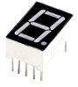 |  |
| ------------------------------------------------------------ | ------------------------------------------------------------ | ------------------------------------------------------------ |
| Keyestudio Plus Mainboard*1                                  | 1-digit Digital Tube*1                                       | 220Ω Resistor*8                                              |
|  |  |  |
| Breadboard*1                                                 | Jumper Wires                                                 | USB Cable*1                                                  |

 **Component Knowledge**


**Display principle:** 

The digital tube display is a semiconductor light-emitting device.  Its basic unit is a light-emitting diode (LED). The digital tube display can be divided into 7-segment digital tube and 8-segment digital tube according to the number of segments. The 8-segment digital tube has one more LED unit than the 7-segment digital tube (used for decimal point display). Each segment of the 7-segment LED display is a separate LED. According to the connection mode of the LED unit, the digital tube can be divided into a common anode digital tube and a common cathode digital tube.

In the common cathode 7-segment digital tube, all the cathodes (or negative electrodes) of the segmented LEDs are connected together, so you should connect the common cathode to GND. To light up a segmented LED, you can set its associated pin to “HIGH”.

In the common anode 7-segment digital tube, the LED anodes (positive electrodes) of all segments are connected together, so you should connect the common anode to “+5V”. To light up a segmented LED, you can set its associated pin to “LOW”.


Each part of the digital tube is composed of an LED. So when you use it, you also need to use a current limiting resistor. Otherwise, the LED will be damaged. In this experiment, we use an ordinary common cathode one-bit digital tube. As we mentioned above, you should connect the common cathode to GND. To light up a segmented LED, you can set its associated pin to “HIGH”.

 **Circuit Diagram and Wiring Diagram**


**Note:** The direction of the 7-segment digital tube inserted into the breadboard is the same as the wiring diagram, and there is one more point in the lower right corner.


 **Code**

The digital display is divided into 7 segments, and the decimal point display is divided into 1 segment. When certain numbers are displayed, the corresponding segment will be illuminated. For example, when the number 1 is displayed, segments b and c will be opened. We compile a subroutine for each number, and compile the main program to display a number every 1 second, and display numbers 9 to 0 in cycles. The display time of each number depends on the delay time, the longer the delay time, the longer the display time.

```C
/*
Keyestudio 2021 Stater Kit
Project 10
1-digit Digital Tube
http//www.keyestudio.com
*/
// sets the IO PIN for every segment
int a=7;// digital PIN 7 for segment a
int b=6;// digital PIN 6 for segment b
int c=5;// digital PIN 5 for segment c
int d=10;//digital PIN 10 for segment d
int e=11;//digital PIN 11 for segment e
int f=8;//digital PIN 8 for segment f
int g=9;//digital PIN 9 for segment g
int dp=4;//digital PIN 4 for segment dp
void digital_0(void) // displays number 0
{
unsigned char j;
digitalWrite(a,HIGH);
digitalWrite(b,HIGH);
digitalWrite(c,HIGH);
digitalWrite(d,HIGH);
digitalWrite(e,HIGH);
digitalWrite(f,HIGH);
digitalWrite(g,LOW);
digitalWrite(dp,LOW);
}
void digital_1(void) // displays number 1
{
unsigned char j;
digitalWrite(c,HIGH);// led sets level for PIN 5 to "high", turns on segment c
digitalWrite(b,HIGH);// turns on segment b
for(j=7;j<=11;j++)// turns off other segments
digitalWrite(j,LOW);
digitalWrite(dp,LOW);// turns off segment dp
}
void digital_2(void) // displays number 2
{
unsigned char j;
digitalWrite(b,HIGH);
digitalWrite(a,HIGH);
for(j=9;j<=11;j++)
digitalWrite(j,HIGH);
digitalWrite(dp,LOW);
digitalWrite(c,LOW);
digitalWrite(f,LOW);
}
void digital_3(void) // displays number 3
{digitalWrite(g,HIGH);
digitalWrite(a,HIGH);
digitalWrite(b,HIGH);
digitalWrite(c,HIGH);
digitalWrite(d,HIGH);
digitalWrite(dp,LOW);
digitalWrite(f,LOW);
digitalWrite(e,LOW);
}
void digital_4(void) // displays number 4
{digitalWrite(c,HIGH);
digitalWrite(b,HIGH);
digitalWrite(f,HIGH);
digitalWrite(g,HIGH);
digitalWrite(dp,LOW);
digitalWrite(a,LOW);
digitalWrite(e,LOW);
digitalWrite(d,LOW);
}
void digital_5(void) // displays number 5
{
unsigned char j;
digitalWrite(a,HIGH);
digitalWrite(b, LOW);
digitalWrite(c,HIGH);
digitalWrite(d,HIGH);
digitalWrite(e, LOW);
digitalWrite(f,HIGH);
digitalWrite(g,HIGH);
digitalWrite(dp,LOW);
}
void digital_6(void) // displays number 6
{
unsigned char j;
for(j=7;j<=11;j++)
digitalWrite(j,HIGH);
digitalWrite(c,HIGH);
digitalWrite(dp,LOW);
digitalWrite(b,LOW);
}
void digital_7(void) // displays number 7
{
unsigned char j;
for(j=5;j<=7;j++)
digitalWrite(j,HIGH);
digitalWrite(dp,LOW);
for(j=8;j<=11;j++)
digitalWrite(j,LOW);
}
void digital_8(void) // displays number 8
{
unsigned char j;
for(j=5;j<=11;j++)
digitalWrite(j,HIGH);
digitalWrite(dp,LOW);
}
void digital_9(void) // displays number 9
{
unsigned char j;
digitalWrite(a,HIGH);
digitalWrite(b,HIGH);
digitalWrite(c,HIGH);
digitalWrite(d,HIGH);
digitalWrite(e, LOW);
digitalWrite(f,HIGH);
digitalWrite(g,HIGH);
digitalWrite(dp,LOW);
}
void setup()
{
int i;// declares a Variable
for(i=4;i<=11;i++)
pinMode(i,OUTPUT);// sets PIN 4-11 to "output"
}
void loop()
{
while(1)
{
digital_9();// displays number 9
delay(1000); // waits a sencond
digital_8();// displays number 8
delay(1000); // waits a sencond
digital_7();// displays number 7
delay(1000); // waits a sencond
digital_6();// displays number 6
delay(1000); // waits a sencond
digital_5();// displays number 5
delay(1000); // waits a sencond
digital_4();// displays number 4
delay(1000); // waits a sencond
digital_3();// displays number 3
delay(1000); // waits a sencond
digital_2();// displays number 2
delay(1000); // waits a sencond
digital_1();// displays number 1
delay(1000);// waits a sencond
digital_0();// displays number 0
delay(1000);// waits a sencond
}}
```

 **Result**

After burning the project code, connecting the wires and powering on, 1-digit digital tube will display numbers from 9 to 0.

## **Project 11: 4-Digit 7-Segment Tube Display**

 **Introduction：**

The 4-digit tube display is low-cost and widely applied to electronic clocks, counters, countdown displays and so on. In this project, we will make the 4-digit 7-segment display show numbers from 0000-9999 through the PLUS control board.

 **Components：**

|  |  |  |
| :----------------------------------------------------------: | ------------------------------------------------------------ | ------------------------------------------------------------ |
|                   Keyestudio PLUS Board\*1                   | 4-Digit Tube Display\*1                                      | 220Ω Resistor\*8                                             |
|  |  |  |
|                        Breadboard\*1                         | Jumper Wires                                                 | USB Cable\*1                                                 |

 **Component Knowledge：**


**4-digit tube display：**

The 4-digit tube display is divided into the anode and cathode . Its working principle is similar to the The 7-segment displays are really just seven LEDs lined up in a particular pattern. In this case, the number ‘8’ shape we’re all familiar with. Each of the seven LEDs is called a segment because when illuminated the segment forms part of a numerical digit (both Decimal and Hex) to be displayed. An additional 8th LED is sometimes used for indication of a decimal point.

Now have a look at the segment configuration so we know which pins light up which segments. The pinout for the 7-segment display is as follows.

The pin G1, G2, G3 and G4 are pins of the control bit.


 **Schematic Diagram**

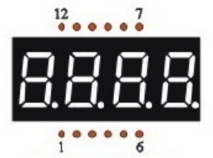

 **Connection Diagram：**


 **Test Code：**

```C
/*
Keyes 2021 starter kit 
Project 11
Four_segment_display
http//www.keyestudio.com
*/
int a = 6;
int b = 7;
int c = 8;
int d = 9;
int e = 10;
int f = 11;
int g = 12;
int dp = 13;

int g4 = 5;
int g3 = 4;
int g2 = 3;
int g1 = 2;

// set variables
long n = 1230;
int x = 100;
int del = 55;    // 

void setup()
{
  pinMode(g1, OUTPUT);
  pinMode(g2, OUTPUT);
  pinMode(g3, OUTPUT);
  pinMode(g4, OUTPUT);
  pinMode(a, OUTPUT);
  pinMode(b, OUTPUT);
  pinMode(c, OUTPUT);
  pinMode(d, OUTPUT);
  pinMode(e, OUTPUT);
  pinMode(f, OUTPUT);
  pinMode(g, OUTPUT);
  pinMode(dp, OUTPUT);
}
/////////////////////////////////////////////////////////////
void loop()
{
  int a=0;
  int b=0;
  int c=0;
  int d=0;
  unsigned long currentMillis = millis();

  while(d>=0)
  {
    while(millis()-currentMillis<10)
     {
      Display(1,a);
      Display(2,b);
      Display(3,c);
      Display(4,d);
     }
    currentMillis = millis(); 
    d++;  
  if (d>9) 
  {
   c++;
   d=0;
  }
    if (c>9) 
  {
   b++;
   c=0;
  }
    if (b>9) 
  {
   a++;
   b=0;
  }
    if (a>9) 
  {
   a=0;
   b=0;
   c=0;
   d=0;
  }
  }  
}
///////////////////////////////////////////////////////////////
void WeiXuan(unsigned char n)//
{
  switch (n)
  {
    case 1:
      digitalWrite(g1, LOW);
      digitalWrite(g2, HIGH);
      digitalWrite(g3, HIGH);
      digitalWrite(g4, HIGH);
      break;
    case 2:
      digitalWrite(g1, HIGH);
      digitalWrite(g2, LOW);
      digitalWrite(g3, HIGH);
      digitalWrite(g4, HIGH);
      break;
    case 3:
      digitalWrite(g1, HIGH);
      digitalWrite(g2, HIGH);
      digitalWrite(g3, LOW);
      digitalWrite(g4, HIGH);
      break;
    case 4:
      digitalWrite(g1, HIGH);
      digitalWrite(g2, HIGH);
      digitalWrite(g3, HIGH);
      digitalWrite(g4, LOW);
      break;
    default :
      digitalWrite(g1, HIGH);
      digitalWrite(g2, HIGH);
      digitalWrite(g3, HIGH);
      digitalWrite(g4, HIGH);
      break;
  }
}
void Num_0()
{
  digitalWrite(a, HIGH);
  digitalWrite(b, HIGH);
  digitalWrite(c, HIGH);
  digitalWrite(d, HIGH);
  digitalWrite(e, HIGH);
  digitalWrite(f, HIGH);
  digitalWrite(g, LOW);
  digitalWrite(dp, LOW);
}
void Num_1()
{
  digitalWrite(a, LOW);
  digitalWrite(b, HIGH);
  digitalWrite(c, HIGH);
  digitalWrite(d, LOW);
  digitalWrite(e, LOW);
  digitalWrite(f, LOW);
  digitalWrite(g, LOW);
  digitalWrite(dp, LOW);
}
void Num_2()
{
  digitalWrite(a, HIGH);
  digitalWrite(b, HIGH);
  digitalWrite(c, LOW);
  digitalWrite(d, HIGH);
  digitalWrite(e, HIGH);
  digitalWrite(f, LOW);
  digitalWrite(g, HIGH);
  digitalWrite(dp, LOW);
}
void Num_3()
{
  digitalWrite(a, HIGH);
  digitalWrite(b, HIGH);
  digitalWrite(c, HIGH);
  digitalWrite(d, HIGH);
  digitalWrite(e, LOW);
  digitalWrite(f, LOW);
  digitalWrite(g, HIGH);
  digitalWrite(dp, LOW);
}
void Num_4()
{
  digitalWrite(a, LOW);
  digitalWrite(b, HIGH);
  digitalWrite(c, HIGH);
  digitalWrite(d, LOW);
  digitalWrite(e, LOW);
  digitalWrite(f, HIGH);
  digitalWrite(g, HIGH);
  digitalWrite(dp, LOW);
}
void Num_5()
{
  digitalWrite(a, HIGH);
  digitalWrite(b, LOW);
  digitalWrite(c, HIGH);
  digitalWrite(d, HIGH);
  digitalWrite(e, LOW);
  digitalWrite(f, HIGH);
  digitalWrite(g, HIGH);
  digitalWrite(dp, LOW);
}
void Num_6()
{
  digitalWrite(a, HIGH);
  digitalWrite(b, LOW);
  digitalWrite(c, HIGH);
  digitalWrite(d, HIGH);
  digitalWrite(e, HIGH);
  digitalWrite(f, HIGH);
  digitalWrite(g, HIGH);
  digitalWrite(dp, LOW);
}
void Num_7()
{
  digitalWrite(a, HIGH);
  digitalWrite(b, HIGH);
  digitalWrite(c, HIGH);
  digitalWrite(d, LOW);
  digitalWrite(e, LOW);
  digitalWrite(f, LOW);
  digitalWrite(g, LOW);
  digitalWrite(dp, LOW);
}
void Num_8()
{
  digitalWrite(a, HIGH);
  digitalWrite(b, HIGH);
  digitalWrite(c, HIGH);
  digitalWrite(d, HIGH);
  digitalWrite(e, HIGH);
  digitalWrite(f, HIGH);
  digitalWrite(g, HIGH);
  digitalWrite(dp, LOW);
}
void Num_9()
{
  digitalWrite(a, HIGH);
  digitalWrite(b, HIGH);
  digitalWrite(c, HIGH);
  digitalWrite(d, HIGH);
  digitalWrite(e, LOW);
  digitalWrite(f, HIGH);
  digitalWrite(g, HIGH);
  digitalWrite(dp, LOW);
}
void Clear()    // clear screens
{
  digitalWrite(a, LOW);
  digitalWrite(b, LOW);
  digitalWrite(c, LOW);
  digitalWrite(d, LOW);
  digitalWrite(e, LOW);
  digitalWrite(f, LOW);
  digitalWrite(g, LOW);
  digitalWrite(dp, LOW);
}
void pickNumber(unsigned char n)// select numbers
{
  switch (n)
  {
    case 0: Num_0();

      break;
    case 1: Num_1();
      break;
    case 2: Num_2();
      break;
    case 3: Num_3();
      break;
    case 4: Num_4();
      break;
    case 5: Num_5();
      break;
    case 6: Num_6();
      break;
    case 7: Num_7();
      break;
    case 8: Num_8();
      break;
    case 9: Num_9();
      break;
    default: Clear();
      break;
  }
}
void Display(unsigned char x, unsigned char Number)//  Take x as the coordinate and display numbers 
{
  WeiXuan(x);
  pickNumber(Number);
  delay(1);
  Clear() ; // clear screens
}
```

 **Test Result：**

 Upload the test code, wire up and power up. The 4-digital tube display shows numbers from 0000-9999

## **Project 12：8*8 Dot Matrix Display**

 **Introduction：**

8*8 Dot matrix module can be used as display screen, like bus station display, advertising screens and bulletin boards.

On the screen there are 64 circles. And inside each circle has an LED light. There are 64 LEDs, pins on the side, 8 on each. You can see other models like 16\*16 Dot matrix, 32\*32 Dot matrix. 

These 64 LEDs can be lit separately, or lit together. Lighten different LED to show different icons.

The single 8*8 dot matrix comes with 8 LEDs on each row and each cols. There are 16 pins on the side, 8 on each.

 **Components：**

|  |  |  |
| ------------------------------------------------------------ | ------------------------------------------------------------ | ------------------------------------------------------------ |
| Keyestudio PLUS Board\*1                                     | 8\*8 Dot Matrix Display \*1                                  | 220Ω Resistor\*8                                             |
|  |  |  |
| Breadboard\*1                                                | Jumper Wires                                                 | USB Cable\*1                                                 |

 **Component Knowledge：**


**8\*8 Dot Matrix Display：**


When the level on a row is 1 and the level on a column is 0 then the corresponding LED will light up.

If you want to light up an LED, for example, you can set the pin 9 to High and pin 13 to Low. If you want to make a row of LEDs light up, you should set the pin 9 to High and set pin ⑬, ③, ④, ⑩, ⑥, ⑪, ⑮ and ⑯ to Low. Equally, turning on a column of LEDs requires to set the pin 13 to Low, and set the pin ⑨, ⑭, ⑧, ⑫, ①, ⑦, ② and ⑤ to High.

As shown below:

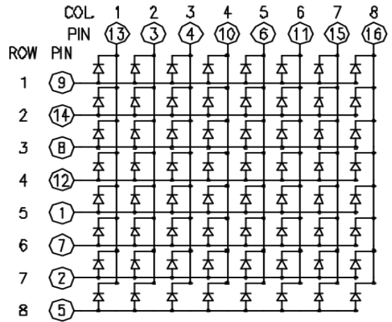

 **Connection Diagram：**


**Note: make the number 788BS on the dot matrix face up.**


 **Test Code：**

```c
/*
Keyes 2021 starter kit
Project 12
12_8_8_Matrix
http//www.keyestudio.com
*/
int R[] = {2,3,4,5,6,7,8,9};
int C[] = {10,11,12,13,A0,A1,A2,A3};

unsigned char data_0[8][8] =
{
{0,0,1,1,1,0,0,0},
{0,1,0,0,0,1,0,0},
{0,1,0,0,0,1,0,0},
{0,1,0,0,0,1,0,0},
{0,1,0,0,0,1,0,0},
{0,1,0,0,0,1,0,0},
{0,1,0,0,0,1,0,0},
{0,0,1,1,1,0,0,0}
};

unsigned char data_1[8][8] =
{
{0,0,0,0,1,0,0,0},
{0,0,0,1,1,0,0,0},
{0,0,0,0,1,0,0,0},
{0,0,0,0,1,0,0,0},
{0,0,0,0,1,0,0,0},
{0,0,0,0,1,0,0,0},
{0,0,0,0,1,0,0,0},
{0,0,0,1,1,1,0,0}
};

unsigned char data_2[8][8] =
{
{0,0,1,1,1,0,0,0},
{0,1,0,0,0,1,0,0},
{0,0,0,0,0,1,0,0},
{0,0,0,0,1,0,0,0},
{0,0,0,1,0,0,0,0},
{0,0,1,0,0,0,0,0},
{0,1,1,1,1,1,0,0},
{0,0,0,0,0,0,0,0}
};

unsigned char data_3[8][8] =
{
{0,0,1,1,1,1,0,0},
{0,0,0,0,0,1,0,0},
{0,0,0,0,0,1,0,0},
{0,0,1,1,1,1,0,0},
{0,0,0,0,0,1,0,0},
{0,0,0,0,0,1,0,0},
{0,0,1,1,1,1,0,0},
{0,0,0,0,0,0,0,0}
};

unsigned char data_4[8][8] =
{
{0,1,0,0,0,0,0,0},
{0,1,0,0,1,0,0,0},
{0,1,0,0,1,0,0,0},
{0,1,1,1,1,1,1,0},
{0,0,0,0,1,0,0,0},
{0,0,0,0,1,0,0,0},
{0,0,0,0,1,0,0,0},
{0,0,0,0,0,0,0,0}
};

unsigned char data_5[8][8] =
{
{0,1,0,0,0,0,0,0},
{0,1,1,1,1,1,0,0},
{0,1,0,0,0,0,0,0},
{0,1,1,1,1,1,0,0},
{0,0,0,0,0,1,0,0},
{0,0,0,0,0,1,0,0},
{0,1,1,1,1,1,0,0},
{0,0,0,0,0,0,0,0}
};

unsigned char data_6[8][8] =
{
{0,1,1,1,1,1,0,0},
{0,1,0,0,0,0,0,0},
{0,1,0,0,0,0,0,0},
{0,1,1,1,1,1,0,0},
{0,1,0,0,0,1,0,0},
{0,1,0,0,0,1,0,0},
{0,1,1,1,1,1,0,0},
{0,0,0,0,0,0,0,0}
};

unsigned char data_7[8][8] =
{
{0,0,0,0,0,0,0,0},
{0,1,1,1,1,1,0,0},
{0,0,0,0,0,1,0,0},
{0,0,0,0,1,0,0,0},
{0,0,0,1,0,0,0,0},
{0,0,1,0,0,0,0,0},
{0,1,0,0,0,0,0,0},
{0,0,0,0,0,0,0,0}
};

unsigned char data_8[8][8] =
{
{0,1,1,1,1,1,0,0},
{0,1,0,0,0,1,0,0},
{0,1,0,0,0,1,0,0},
{0,1,1,1,1,1,0,0},
{0,1,0,0,0,1,0,0},
{0,1,0,0,0,1,0,0},
{0,1,1,1,1,1,0,0},
{0,0,0,0,0,0,0,0}
};

unsigned char data_9[8][8] =
{
{0,1,1,1,1,1,0,0},
{0,1,0,0,0,1,0,0},
{0,1,0,0,0,1,0,0},
{0,1,1,1,1,1,0,0},
{0,0,0,0,0,1,0,0},
{0,0,0,0,0,1,0,0},
{0,1,1,1,1,1,0,0},
{0,0,0,0,0,0,0,0}
};

void Display(unsigned char dat[8][8])
{
for(int c = 0; c<8;c++)
{
digitalWrite(C[c],LOW);
for(int r = 0;r<8;r++)
{
digitalWrite(R[r],dat[r][c]);
}
delay(1);
Clear();
}
}

void Clear()
{
for(int i = 0;i<8;i++)
{
digitalWrite(R[i],LOW);
digitalWrite(C[i],HIGH);
}
}

void setup(){
  for(int i = 0;i<8;i++)
  {
    pinMode(R[i],OUTPUT);
    pinMode(C[i],OUTPUT);
  }

}

void loop(){
  for (int i = 1; i <= 100; i = i + (1)) {
    Display(data_0);
  }
  for (int i = 1; i <= 100; i = i + (1)) {
    Display(data_1);
  }
  for (int i = 1; i <= 100; i = i + (1)) {
    Display(data_2);
  }
  for (int i = 1; i <= 100; i = i + (1)) {
    Display(data_3);
  }
  for (int i = 1; i <= 100; i = i + (1)) {
    Display(data_4);
  }
  for (int i = 1; i <= 100; i = i + (1)) {
    Display(data_5);
  }
  for (int i = 1; i <= 100; i = i + (1)) {
    Display(data_6);
  }
  for (int i = 1; i <= 100; i = i + (1)) {
    Display(data_7);
  }
  for (int i = 1; i <= 100; i = i + (1)) {
    Display(data_8);
  }
  for (int i = 1; i <= 100; i = i + (1)) {
    Display(data_9);
  }
}
```

 **Test Result**

Upload the code, connect the wiring diagram and power up. Then 8\*8 dot matrix will show numbers from 0 to 9.

## **Project 13: A Desk Lamp**

 **Introduction**

Did you know that Arduino can light up an LED when you press a button? In this project, we will use the Plus Mainboard, a key switch and an LED to make a small desk lamp.

 **Components Required**

|  | 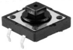 |  |
| ------------------------------------------------------------ | ------------------------------------------------------------ | ------------------------------------------------------------ |
| Keyestudio Plus Mainboard\*1                                 | Button\*1                                                    | Red LED\*1                                                   |
|  |  |  |
| Breadboard\*1                                                | 220Ω Resistor\*1                                             | USB Cable\*1                                                 |
|  |  |  |
| 10KΩ Resistor\*1                                             | Button Cap\*1                                                | Jumper Wires                                                 |

 **Component Knowledge**


**Button:** 

The button can control the circuit on and off. The circuit is disconnected when the button is not pressed. But it breaks when you release it. Why does it only work when you press it? It starts from the internal structure of the button, which is shown in the figure:. 

Before the button is pressed, 1 and 2 are on, 3 and 4 are also on, but 1, 3 or 1, 4 or 2, 3 or 2, 4 are off (not working). Only when the button is pressed, 1, 3 or 1, 4 or 2, 3 or 2, 4 are on.

The key switch is one of the most commonly used components in circuit design.

 **Schematic diagram**


**What is button jitter?**

We think of the switch circuit as "press the button and turn it on immediately", "press it again and turn it off immediately". In fact, this is not the case.

The button usually uses a mechanical elastic switch, and the mechanical elastic switch will produce a series of jitter due to the elastic action at the moment when the mechanical contact is opened and closed (usually about 10ms). As a result, the button switch will not immediately and stably turn on the circuit when it is closed, and it will not be completely and instantaneously disconnected when it is turned off. 


**How to eliminate the jitter?**

There are two common methods, namely fix jitter in the software and hardware. We only discuss the  jitter removal in the software.

We already know that the jitter time generated by elasticity is about 10ms, and the delay command can be used to delay the execution time of the command to achieve the effect of jitter removal.

Therefore, we delay 0.05s in the code to achieve the key anti-shake function.


 **Circuit Diagram and Wiring Diagram**


**Note:**

How to connect the LED


How to identify the 220Ω 5-band resistor and 10KΩ 5-band resistor


 **Code**

```c
/*
Keyestudio 2021 starter learning kit
Project 13
Small_Desk_Lamp
http//www.keyestudio.com
*/
int buttonPin = 5;               //the button is connected to 5
int ledPin = 12;                 // LED is interfaced with 12
int ledState = LOW;            // ledState records the state of the LED
int buttonState;                 // buttonState records the state of the button
int lastButtonState = LOW;     // lastbuttonState the state that the button is pressed before
long lastDebounceTime = 0;
long debounceDelay = 50;        
void setup() {
  pinMode(buttonPin, INPUT);
  pinMode(ledPin, OUTPUT);
  digitalWrite(ledPin, ledState);
}
void loop() {
    //reading is used to save the data of the buttonPin
  int reading = digitalRead(buttonPin);

  //record the current timee once the data changes
  if (reading != lastButtonState) {
      lastDebounceTime= millis();
  }

  // wait for 50ms and determine again to make sure whether the state is as same as the state of the button. if not, change the state of the button. at same time, if the state of the button is high（pressed）then change the state of the led
  if ((millis() - lastDebounceTime) >debounceDelay) {
    if (reading != buttonState) {
      buttonState = reading;
      if (buttonState == HIGH) {
          ledState= !ledState;
      }
    }
  }

  digitalWrite(ledPin, ledState);

  // chnage the previous state value of the button
  lastButtonState = reading;
}
```

 **Result**

Burn the project code, connect the wires and power on first. Then press the button, the LED will turn on. Press the button again, the LED will turn off.

## **Project 14: Electronic Hourglass**

 **Introduction**

In this lesson, we will use the Plus mainboard to control the tilt switch and an LED simulate and make an electronic hourglass.

 **Components Required**

|  |  |  |  |
| ------------------------------------------------------------ | ------------------------------------------------------------ | ------------------------------------------------------------ | ------------------------------------------------------------ |
| Keyestudio Plus Mainboard\*1                                 | Tilt Switch\*1                                               | Red LED\*4                                                   | 10KΩ Resistor\*1                                             |
|  |  |  |  |
| Breadboard\*1                                                | 220Ω Resistor\*4                                             | USB Cable\*1                                                 | Jumper Wires                                                 |

 **Component Knowledge**


Tilt switch is also called digital switch. Inside is a metal ball that can roll. The principle of rolling the metal ball to contact with the conductive plate at the bottom, which is used to control the on and off of the circuit. When it is a rolling ball tilt sensing switch with single directional trigger, the tilt sensor is tilted toward the trigger end (two gold-plated pin ends), the tilt switch is in a closed circuit and the voltage at the analog port is about 5V (binary number is 1023). In this way, the LED will light up. When the tilt switch is in a horizontal position or tilted to the other end, it is open and the voltage of the analog port is about 0V (binary number is 0), the LED will turn off. In the program, we judge the state of the switch based on whether the voltage value of the analog port is greater than 2.5V (binary number is 512).

As shown in the figure, use the internal structure of the tilt switch to illustrate how it works.


 **Circuit Diagram and Wiring Diagram**


Note:

How to connect the LED


How to identify the 220Ω 5-band resistor and 10KΩ 5-band resistor


 **Test Code**

```c
/*
Keyestudio 2021 starter learning kit
Project 14
Electronic_Hourglass
http//www.keyestudio.com
*/
const byte SWITCH_PIN = 4; // the tilt switch is connected to 4
byte switch_state = 0;
void setup()
{
     for(int i=8;i<12;i++)
  {
        pinMode(i, OUTPUT);
  } 
    pinMode(SWITCH_PIN, INPUT);
 for(int i=8;i<12;i++)
  {
    digitalWrite(i,0);
  } 
  Serial.begin(9600);
}
void loop()
{
switch_state = digitalRead(SWITCH_PIN); 
Serial.println(switch_state);
 if (switch_state == 0) 
 {
 for(int i=8;i<12;i++)
  {
    digitalWrite(i,1);
    delay(1000);
  } 
  }
   if (switch_state == 1) 
 {
   for(int i=11;i>7;i--)
   {
    digitalWrite(i,0);
    delay(1000);
   }
  }
}
```

 **Result**

Upload project code, wire up and power up, hold the breadboard. Tilt to a certain angle, the LEDs will light up one by one. When returning to the original angle, the LEDs will turn off one by one.

## **Project 15: I2C LCD_128X32_DOT**

 **Introduction**

We can use modules such as monitors to do various experiments in life. You can also DIY a variety of small objects. For example, you can make a temperature meter with a temperature sensor and display, or make a distance meter with an ultrasonic module and display.

In this project, we will use the LCD_128X32_DOT module as a display and connect it to the Plus control board. The Plus mainboard will be used to control the LCD_128X32_DOT display to show various English characters, common symbols and numbers.

 **Components Required**

|  |  |  |  |
| ------------------------------------------------------------ | ------------------------------------------------------------ | ------------------------------------------------------------ | ------------------------------------------------------------ |
| Keyestudio Plus Mainboard\*1                                 | LCD_128X32_DOT\*1                                            | F-F Dupont Wires                                             | USB Cable\*1                                                 |

 **Component Knowledge**


**LCD_128X32_DOT:** 

It is an LCD module with 128*32 pixels and its driver chip is ST7567A. The module uses the IIC communication mode, while the code contains a library of all alphabets and common symbols that can be called directly. When using, we can also set it in the code so that the  English letters and symbols show different text sizes.

**Schematic diagram:**


**Features:**

- Pixel：128\*32 character

- Operating voltage(chip)：4.5V to 5.5V

- Operating current：100mA (5.0V)

- Optimal operating voltage(module):5.0V


 **Connection Diagram**


 **Code**

**Note：**The library file is required in the code. If you have already added the “**lcd**”library file, you can ignore the process of adding library files.

Put the decompressed “**LCD_128X32**” folder into “\\Arduino\\libraries” under the compiler installation directory.

After successful placement, you need to restart the compiler, otherwise the compilation will not work.

e.g.：C:\\Program Files\\Arduino\\libraries

```c
/*
Keyestudio 2021 starter learning kit
Project 16
I2C LCD_128X32_DOT
http//www.keyestudio.com
*/
#include <lcd.h>  //add library files
lcd Lcd;  //define a Lcd class instance

void setup() {
  Lcd.Init(); //initialize
  Lcd.Clear();  //clear
}

void loop() {
  Lcd.Cursor(0, 4); //Set the first row and the eighth column to display, same as below
  Lcd.Display("KEYESTUDIO"); //Display KEYESTUDIO, same as below
  Lcd.Cursor(1, 0);
  Lcd.Display("ABCDEFGHIJKLMNOPQR");
  Lcd.Cursor(2, 0);
  Lcd.Display("123456789+-*/<>=$@");
  Lcd.Cursor(3, 0);
  Lcd.Display("%^&(){}:;'|?,.~\\[]");
}
```

 **Result**

Upload the project code, wire up and power on, the LCD module display will show "KEYESTUDIO" at the first line. "ABCDEFGHIJKLMNOPQR" will be displayed at the second line. "123456789 + - \* / \<\> = \$ @ " will shown at the third line and "% \^ & () {} :; '\|?,. \~ \\\\ [] " will be displayed at the fourth line.

## **Project 16: Fan**

 **Introduction：**

In this lesson, we will make a small fan with a PLUS control board and a DC motor.

 **Components：**

|  |  |  |  |
| ------------------------------------------------------------ | ------------------------------------------------------------ | ------------------------------------------------------------ | ------------------------------------------------------------ |
| Keyestudio PLUS Board\*1                                     | S8050 Triode\*1                                              | DC Motor\*1                                                  | S8550 Triode\*1                                              |
|  |  |  |  |
| Breadboard\*1                                                | USB Cable\*1                                                 | Jumper Wires                                                 | Fan\*1                                                       |

 **Component Knowledge:**


**Triode：**

It is referred as the semiconductor triode and a bipolar transistor or a transistor.

The triode is one of the basic semiconductor components as the core of the electronic circuit., which can amplify current. The triode means that two PN junctions are made on a semiconductor wafer. The two PN junctions divide the entire semiconductor into three parts. The middle part is the base area, and the two sides are the emitter and collector areas.

As for NPN triode, it is composed of two N type semiconductors and a P type semiconductor.

The type of transistor which may be used in some applications in place of the triode tube is the "junction" transistor, which actually has two junctions. It has an emitter, base, and collector which correspond to the cathode, grid, and plate, respectively, in the triode tube. Junction transistors are of two types, the NPN type and the PNP type.

The PN junction between the emitting area and the base area is emitter junction and the PN junction flanked by the collector area and the base area is collector junction. And three pins are E（Emitter, B (Base)and C (Collector).

**S8050（NPN triode）**


**S8550（PNP triode）**


The S8050 transistor is a low-power NPN silicon tube and its the maximum voltage of collector and base can reach 40V and the current of the collector is (Ic) 0.5A.

The pins of the S8050 transistor should facing down, pin 1 is the emitter (E pole), pin 2 is the base (B pole), and pin 3 is the collector (C pole). Similarly, the S8550 transistor is the same. 


The commonly used triodes are divided into two types: PNP type triode and NPN type triode. S8550 is the PNP type triode, S8050 is the NPN type triode, what we provide in this kit are S8050 and S8550.


 **Connection Diagram 1：**

（we apply the S8050(NPN triode) in this experiment to control the motor）


 **Test Code 1：**

```c
/*
Keyestudio 2021 stater kit
Project 16.1
Small_Fan
http//www.keyestudio.com
*/
// when the rest button is pressed or power up the control board, the set function executes once
void setup() {
  // the digital 3 is taken as the OUTPUT
  pinMode(3, OUTPUT);
}

//the loop function repeats over and over again
void loop() {
  digitalWrite(3, HIGH);   // turn on the motor(HIGH)
  delay(4000);              // delay in 4s
  digitalWrite(3, LOW);    // lower the voltage, turn off the motor
  delay(3000);              // delay in 3s
}
```

 **Test Result 1：**

Upload the code to the control board, wire up and install the fan on the DC motor and power up. Then the motor will rotate clockwise for 4s then stop for 3s, circularly.

 **Connection Diagram2：**

（we apply the S8550 (PNP triode) in this experiment to control the motor）


 **Test Code 2：**

```c
/*
Keyestudio 2021 starter kit
Project 16.2
Small_Fan
http//www.keyestudio.com
*/
// when the rest button is pressed or power up the control board, the set function executes once
void setup() {
  // the digital 3 is taken as the OUTPUT
  pinMode(3, OUTPUT);
}

// the loop function repeats over and over again
void loop() {
  digitalWrite(3, LOW);   //  turn on the motor(LOW)
  delay(4000);              // delay in 4s
  digitalWrite(3, HIGH);    //make voltage rise up，turn off the motor
  delay(3000);              // delay in 3s
}
```

 **Test Result 2：**

Upload the code to the control board, wire up and install the fan on the DC motor and power up. Then the motor will rotate anticlockwise for 4s then stop for 3s, circularly.

## **Project 17: Dimming Light**

 **Introduction**

A potentiometer is a three-terminal resistor with a sliding or rotating contact that forms an adjustable voltage divider. It works by varying the position of a sliding contact across a uniform resistance. In a potentiometer, the entire input voltage is applied across the whole length of the resistor, and the output voltage is the voltage drop between the fixed and sliding contact.

In this project, we are going to learn how to use Arduino to read the values of the potentiometer, and make a dimming lamp.

 **Components Required**

|  |  |  |  |
| ------------------------------------------------------------ | ------------------------------------------------------------ | ------------------------------------------------------------ | ------------------------------------------------------------ |
| Keyestudio Plus Mainboard\*1                                 | Potentiometer\*1                                             | Red LED\*1                                                   | 200Ω Resistor\*1                                             |
|  |  |  |                                                              |
| Breadboard\*1                                                | USB Cable\*1                                                 | Jumper Wires                                                 |                                                              |

 **Component Knowledge**


**Adjustable potentiometer:** 

It is a kind of resistor and an analog electronic component, which has two states of 0 and 1(high level and low level). The analog quantity is different, its data state presents a linear state such as 0 to 1023.

 **Read the Potentiometer Value**

We connect the adjustable potentiometer to the analog pin of Arduino to read its value. Please refer to the following wiring diagram for wiring.


```c
/*
Keyestudio 2021 Starter Kit
Project 17.1
Read_the_adjustable_potentiometer_analog_value
http//www.keyestudio.com
*/
int potpin=A1;// initializes analog PIN A1 of the potentiometer
int val=0;// defines "val" with an initial value of 0
void setup()
{
Serial.begin(9600);// sets baud rate to 9600
}
void loop()
{
val=analogRead(potpin);// reads the analog value of analog PIN A1 and assigns it to "val"
Serial.println(val);// displays the value of "val"
}
```

Upload the code to the Plus mainboard, connect the wires and power on first. Open the serial monitor, set the baud rate to 9600. When you rotate the potentiometer knob, you can see the displayed value change. After calculation, you can get the corresponding value you need.

Below figure shows the analog value it reads. 


 **Circuit Diagram and Wiring Diagram**

In the last step, we read the value of the potentiometer, and now we need to convert the value of the potentiometer into the brightness of the LED to make a lamp that can adjust the brightness. The wiring diagram is as follows.


 **Code**

```c
/*
Keyestudio 2021 Starter Kit
Project 17.2
Dimming_light
http//www.keyestudio.com
*/
int potpin=A1;// initializes analog PIN A1 of the adjustable potentiometer
int ledpin=11;// initializes the digital PIN 11
int val=0;// defines "val" with an initial value of 0
void setup()
{
pinMode(ledpin,OUTPUT);// sets digital pin to "output"
Serial.begin(9600);// sets baudrate to 9600
}
void loop()
{
val=analogRead(potpin);// reads the analog value of analog PIN A1 and assigns it to "val"
analogWrite(ledpin,val/4);
Serial.println(val);// displays the value of "val"
}
```

 **Result**

 Upload the code to the mainboard, connect the wires and power on first. Then open the serial monitor, set the baud rate to 9600, and the monitor will display the value of potentiometer. When we turn the knob of the potentiometer, the brightness of the LED will change.

## **Project 18: Flame Alarm**

 **Introduction**

In this project, we will use the Plus mainboard, a flame sensor and a buzzer to make fire alarm devices.

 **Components Required**

|  |  |  |  |
| ------------------------------------------------------------ | ------------------------------------------------------------ | ------------------------------------------------------------ | ------------------------------------------------------------ |
| Keyestudio Plus Mainboard\*1                                 | Flame Sensor\*1                                              | Active Buzzer\*1                                             | 10KΩ Resistor\*1                                             |
|  |  |  |                                                              |
| Breadboard\*1                                                | USB Cable\*1                                                 | Jumper Wires                                                 |                                                              |

 **Component Knowledge**


**Flame Sensor**：

The flame emits a certain degree of IR light, which is invisible to the human eye, but our flame sensor can detect it and alert the microcontroller. If the Arduino has detected a fire, it has a specially designed infrared receiver to detect the flame, and then convert the flame brightness into a fluctuating level signal. The short pin of the receiving triode is negative pole and the other long pin is positive pole. We should connect the short pin (negative pole) to 5V and the long pin (positive pole) to the analog pin, a resistor and GND. As shown in the figure below.

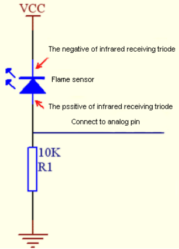

Note: Since vulnerable to radio frequency radiation and temperature changes, the flame sensor should be kept away from heat sources like radiators, heaters and air conditioners, as well as direct irradiation of sunlight, headlights and incandescent light.

 **Read the Simulation Value**

We start with a simple code to read the value of the flame sensor and print it on the serial monitor. For wiring, please refer to the following wiring diagram.


```c
/*
Keyestudio 2021 Starter Kit
Project 18.1
Read_the_flame_sensor_analog_value
http//www.keyestudio.com
*/
int flamepin=A1;// initializes analog PIN A1
int val=0;// defines "val" with an initial value of 0
void setup()
{
Serial.begin(9600);// sets baudrate to 9600
}
void loop()
{
val=analogRead(flamepin);// reads the analog value of analog PIN A1 and assigns it to "val"
Serial.println(val);// displays the value of "val"
}
```

Upload the code to the Plus Mainboard, connect the wires and power on first. Turn on the serial monitor and set the baud rate to 9600, and approach the flame sensor with a lighter flame to see its analog value.


 **Circuit Diagram and Wiring Diagram**

Next, we will use flame sensor and buzzer, RGB LED to make an interesting project, that is flame alarm. When flame is detected, RGB LED is red and buzzer alarms.

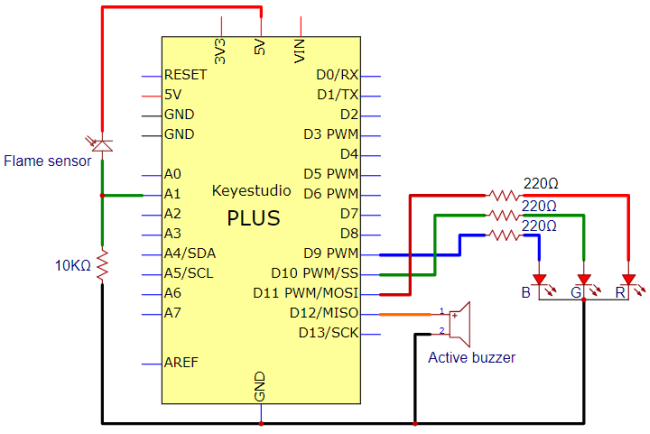


 **Code**

```c
/*
Keyestudio 2021 Starter Kit
Project 18.2
Fire_alarm
http//www.keyestudio.com
*/
const int red = 11;
const int green = 10;
const int blue= 9;
const int buzzer = 12;
const int flamepin = A1;
const int thereshold = 30;
void setup() {
  // puts the setup code here and runs it once
  Serial.begin(9600);
  pinMode(red, OUTPUT);
  pinMode(green, OUTPUT);
  pinMode(blue, OUTPUT);
  pinMode(buzzer, OUTPUT);
  pinMode(flamepin, INPUT);
 
}
void setColor(int redValue, int greenValue, int blueValue)
 {
analogWrite(red, redValue);
analogWrite(blue, blueValue);
analogWrite(green, greenValue);
}
 
void loop() {
  // puts the main code here and repeats
  int flamesenseval = analogRead(flamepin);
  Serial.println(flamesenseval);
  if (flamesenseval >= thereshold) {
    setColor(255, 0, 0); //red
    tone(buzzer, 1000);
    delay(10);
  }
  else
  {
    setColor(0, 255, 0); // green
    noTone(buzzer);
  }
}
```

 **Result**

Upload the code to the Plus mainboard, connect the wires and power on first. Then open the serial monitor and set the baud rate to 9600, the monitor will display the value of the flame sensor. We use light the fire and keep it close to the flame sensor, the RGB LED will become red and the buzzer will alarm. Otherwise, the RGB LED will turn green and the buzzer doesn’t emit sounds.

 

## **Project 19: Optic Control Lamp**

 **Introduction**

Sensors or components are ubiquitous in our daily life. For example, some public street lights turn on automatically at night and turn off automatically during the day. These make use of a photosensitive element that senses the intensity of external ambient light. When the outdoor brightness decreases at night, the street lights will automatically turn on. In the daytime, the street lights will automatically turn off. The principle of this is very simple. 

In this lesson we will implement the function of this street light.

 **Components Required**

|  |  |  |  |
| ------------------------------------------------------------ | ------------------------------------------------------------ | ------------------------------------------------------------ | ------------------------------------------------------------ |
| Keyestudio Plus Mainboard\*1                                 | Photoresistor\*1                                             | Red LED\*1                                                   | 220Ω Resistor\*1                                             |
|  |  |  |  |
| 10KΩ Resistor\*1                                             | Breadboard\*1                                                | Jumper Wires                                                 | USB Cable\*1                                                 |

 **Component Knowledge**


**Photoresistor:**

Photosensor is a kind of resistor made by using the photoelectric effect of semiconductor, the resistance value changes with the intensity of the incident light, also known as photoelectric detector. When the surrounding light becomes stronger, the resistance becomes smaller and the analog signal becomes larger. Conversely, when the light becomes weaker, the resistance increases and the analog signal becomes smaller.

The commonly used material for making photosensor is cadmium sulfide, in addition to selenium, aluminum sulfide, lead sulfide and bismuth sulfide and so on. These materials have the characteristic that their resistance decreases rapidly under the irradiation of light of a specific wavelength. This is because the carriers generated by the light are involved in the conduction and drift under the action of the applied electric field. The electrons rush to the positive electrode of the power supply, and the holes rush to the negative electrode of the power supply, so that the resistance of the photosensor drops rapidly.

Photoresistor is commonly applied in the measurement of light, light control and photovoltaic conversion (convert the change of light into the change of electricity).

Photoresistor is also being widely applied to various light control circuit, such as light control and adjustment, optical switches, etc.


We will start with a relatively simple experiment regarding to photovaristor application.

 **Read the Analog Value**

We first use a simple code to read the value of the photoresistor, print it in the serial monitor. For wiring, please refer to the following wiring diagram.


```c
/*
Keyestudio 2021 Starter Kit
Project 19.1
Read_the_photosensitive_resistance_analog_value
http//www.keyestudio.com
*/
int photocellpin=A0;// initializes the analog PIN A0 connected to the photoresistor
int val=0;// initializes the variable "val" with a value of 0
void setup()
{
Serial.begin(9600);// sets baudrate to 9600
}
void loop()
{
val=analogRead(photocellpin);// reads the value of the sensor and assigns its value to "val"
Serial.println(val);// displays the value of "val"
delay(200);// waits 0.2 second
}
```

Upload the code to the Plus Mainboard, wire up and power up, open the serial monitor and set the baud rate to **9600**. Then you can read the analog value of photoresistor. When the light intensity around the sensor gets dim, the analog value displayed on the serial monitor will gradually reduce. On the contrary, the analog value will gradually increase.


 **Circuit Diagram and Wiring Diagram**

Next, we make an optical control lamp.


 **Code**

```c
/*
Keyestudio 2021 Starter Kit
Project 19.2
Optical Control Lamp
http//www.keyestudio.com
*/
int photocellpin=A0;// initializes the analog PIN A0 connected to the photoresistor
int ledpin=11;//  initializes digital PIN 11
int val=0;// initializes the variable "val" with a value of 0
void setup()
{
pinMode(ledpin,OUTPUT);// sets digital PIN 11 to "output"
Serial.begin(9600);// sets baudrate to 9600
}
void loop()
{
val=analogRead(photocellpin);//reads the analog value of the sensor and assigns its value to "val"
Serial.println(val);//displays the value of "val"
analogWrite(ledpin,val/4);//sets brightness (Max:255)
delay(10);// waits 0.01 second
}
```

 **Result**

Upload the code to the Plus mainboard, wire up and power up, open the serial monitor and set the baud rate to **9600**.

Then you can read the analog value of photoresistor. When the light intensity around the sensor gets dim, the analog value displayed on the serial monitor will gradually reduce. On the contrary, the analog value will gradually increase.

## **Project 20: Temperature Instrument**

 **Introduction**

Thermistor is a kind of resistor whose resistance depends on temperature changes. Therefore, we can use this feature to make a temperature instrument.

 **Components Required**

|  |  |  |  |
| ------------------------------------------------------------ | ------------------------------------------------------------ | ------------------------------------------------------------ | ------------------------------------------------------------ |
| Keyestudio Plus Mainboard\*1                                 | Thermistor\*1                                                | LCD_128X32_DOT\*1                                            | 4.7KΩ Resistor\*1                                            |
|  |  |  |  |
| Breadboard\*1                                                | USB Cable\*1                                                 | F-F Dupont Wires                                             | Jumper Wires                                                 |

 **Component Knowledge**

**Thermistor:** 

A thermistor is a temperature sensitive resistor. When it senses a change in temperature, the thermistor's resistance changes. We can use this feature to detect temperature intensity with thermistor. This is widely used in gardening, home alarm systems and other devices.

①The NTC-MF52AT 10K thermistor is used here, where B is 3950 and it is connected in series with  RS (RS=Rbalance=4.7KΩ resistor). The resistance value of the thermistor changes as the temperature changes.


**②Calculation of NTC thermistor:**

Calculation formula: 
$$
Rt = R*EXP[B*(1/T1-1/T2)]
$$
**T1** and **T2** refer to K degrees, that is, Kelvin temperature.

**Rt** is the resistance of the thermistor at T1 temperature.

**R** is the nominal resistance value of the thermistor at T2 room temperature. The value of the 10K thermistor at 25℃ is 10K (R=10K). T2 = (273.15 + 25).

**EXP[n]** is the nth power of e.

**B** is an important parameter of thermistor, B equals 3950.

We can use the value measured by the ADC converter to get the resistance value of the thermistor, and then use the formula to get the temperature value. 

t=((T1\*B)/(B+T1\*ln(Rt/R1)))-273.15，“ln”can be converted to “log”, that is , t=((T1\*B)/(B+T1\*log(Rt/R1)))-273.15. Error is ±0.5.

 **Read the Values**

First we learned how to use the serial monitor to print the thermistor values. Please connect the wires according to the following wiring diagram.

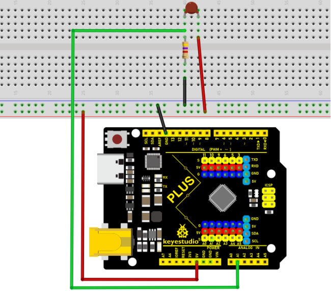

```c
/*
Keyestudio 2021 starter learning kit
Project 20.1
Read_the_thermistor_analog_value
http//www.keyestudio.com
*/
#include<math.h>

const float voltagePower=5.0;
const float Rs=4.7;//sample resistance is 4.7KΩ 
const int B=3950;
const double T1=273.15+25;//ordinary temperature
const double R1=10;//ordinary temperature corresponds the resistance value, unit is KΩ
void setup() {
  Serial.begin(9600);
}
void loop() { 
  //Attain the voltage value at A1
  double digitalValue=analogRead(1);
  double voltageValue=(digitalValue/1023)*5;
  Serial.print("Current voltage value=");
  Serial.println(voltageValue);
  
  //Obtain the resistance of the thermistor through the voltage divider ratio 
  double Rt=((voltagePower-voltageValue)*Rs)/voltageValue;
  Serial.print("Current registor value=");
  Serial.println(Rt);
 
  //Converted to get the temperature value 
  Serial.print("Current temperature value=");
  Serial.println(((T1*B)/(B+T1*log(Rt/R1)))-273.15);//
  Serial.println();
    
  //output for each 3 second, change the frequency
  delay(3000); 
}
```

Upload the code to the Plus Mainboard, connect the wires and power on first. Then open the serial monitor, the voltage value at thermistor pin A1 can be read, and the resistance value and temperature value of the thermistor can be obtained through the voltage division ratio. As shown below.


 **Circuit Diagram and Wiring Diagram**


 **Code**

**Note：**The “**LCD_128X32**”library file needs to be installed in the code.If the library file has been added, ignore the process of adding the library file below.

Decompress the library files in the folder, that is, put the decompressed “**LCD_128X32**” folder into “\\Arduino\\libraries” under the compiler installation directory.

After successful placement, you need to restart the compiler, otherwise the compilation will not work.

e.g.：C:\\Program Files\\Arduino\\libraries

```c
/*
Keyestudio 2021 starter learning kit
Project 20.2
Temperature_Instrument
http//www.keyestudio.com
*/
#include <math.h>
#include <lcd.h>  //add library files
lcd Lcd;  //define a Lcd class instance
const float voltagePower=5.0;
const float Rs_val=4.7;//sample resistance is 4.7KΩ 
const int B=3950;
const double T1=273.15+25;//normal temperature
const double R1=10;//ordinary temperature corresponds the resistance value, unit is KΩ
char string[10];

void setup(){
Serial.begin(9600);
Lcd.Init(); //initialize
Lcd.Clear();  //clear
}

void loop(){
// attain the voltage value at A1
double digitalValue=analogRead(1);
double voltageValue=(digitalValue/1023)*5;
  
//Obtain the resistance of the thermistor through the voltage divider ratio 
double Rt=((voltagePower-voltageValue)*Rs_val)/voltageValue;

//Converted to get the temperature value 
const float t=((T1*B)/(B+T1*log(Rt/R1)))-273.15;

if(t>-100.0) //If the temperature is greater than -100°C, the LCD display voltage value,obtains the resistance value of the thermistor through the voltage division ratio and temperature value 
{
Lcd.Cursor(0,0);
Lcd.Display("C v v=");
Lcd.Cursor(0,7);
Lcd.DisplayNum(voltageValue);
Lcd.Cursor(0, 10);
Lcd.Display("V");

Lcd.Cursor(1,0);
Lcd.Display("C r v=");
Lcd.Cursor(1,7);
Lcd.DisplayNum(Rt);
Lcd.Cursor(1, 10);
Lcd.Display("R");

Lcd.Cursor(2, 0);
Lcd.Display("C t v=");
Lcd.Cursor(2, 7);
Lcd.DisplayNum(t);
Lcd.Cursor(2, 10);
Lcd.Display("C");
}
delay(300);
}
```

 **Result**

After uploading the code to the Plus mainboard, connecting the wires and powering on, the LCD_128X32_DOT displays the voltage value of the corresponding A1 pin, obtain the resistance value of the thermistor through the voltage division ratio and the temperature value in the current environment .

（Only integers can be displayed, not decimals on the LCD_128X32_DOT）

